<h1><strong>COMBINING USER PROFILING AND SEGMENTATION, AND TEXT ANALYSIS FOR TARGETED AD CAMPAIGNS</strong></h1>

<h2><strong>Introduction</strong></h2>

This project delves into the power of combining user profiling, segmentation, and text analysis to extract valuable customer insights from user data. The project utilizes a sample dataset containing user profiles and their online behavior, including potential text data sources like:

<ul><li><strong>Top Interests: </strong> text associated with primary interests of the user.</li></ul>

<h2><strong>Goals</strong></h2>
<ul>
    <li><strong>Develop user profiles</strong> that capture key demographic and online behavior characteristics.</li>
    <li><strong>Segment users</strong> into distinct groups based on shared characteristics using clustering techniques.</li>
    <li><strong>Analyze user-generated text data</strong> associated with different user segments to understand their preferences, opinions, and pain points.</li>
    <li><strong>Identify patterns and trends</strong> within user segments using text analysis techniques.</li>
    <li><strong>Leverage user segmentation and text analysis insights</strong> to develop targeted marketing campaigns that achieve:
        <ul>
            <li><strong>Increased Relevancy:</strong> Content and promotions become more relevant to users' specific needs and interests, leading to higher engagement.</li>
            <li><strong>Improved Conversion Rates:</strong> Tailored messaging resonates better with users, potentially increasing conversion rates for desired actions.</li>
            <li><strong>Enhanced User Experience:</strong> By addressing the preferences of various user segments, the overall user experience improves.</li>
        </ul>
    </li>
</ul>

<h2><strong>Data Description</strong></h2>

The project utilizes a sample dataset containing user profiles with the features:

<ul>
    <li>User ID (unique identifier)</li>
    <li>Demographics (Age, Gender, Location, Language, Education Level)</li>
    <li>Online Behavior (Likes and Reactions, Followed Accounts, Device Usage, Time Spent Online, Click-Through Rates, Conversion Rates, Ad Interaction Time)</li>
    <li>Income Level</li>
    <li>Top Interests (text data)</li>
</ul>

<strong>Below is a comprehensive overview of each column present in the dataset.</strong>

<ul>
    <li><strong>User ID:</strong> A unique identifier assigned to each user.</li>
    <li><strong>Age:</strong> The age group of the user, categorized into ranges.</li>
    <li><strong>Gender:</strong> The gender identity of the user.</li>
    <li><strong>Location:</strong> Describes the type of location where the user resides, categorized as Urban, Suburban, or Rural.</li>
    <li><strong>Language:</strong> Indicates the primary language spoken by the user.</li>
    <li><strong>Education Level:</strong> Reflects the highest level of education attained by the user.</li>
    <li><strong>Likes and Reactions:</strong> Represents the total count of likes and reactions expressed by the user.</li>
    <li><strong>Followed Accounts:</strong> Indicates the number of accounts that the user follows.</li>
    <li><strong>Device Usage:</strong> Specifies the primary device utilized by the user to access the platform, including options such as Mobile, Desktop, or Tablet.</li>
    <li><strong>Time Spent Online (hrs/weekday):</strong> The average duration spent by the user online during weekdays, measured in hours.</li>
    <li><strong>Time Spent Online (hrs/weekend):</strong> The average duration spent by the user online during weekends, measured in hours.</li>
    <li><strong>Click-Through Rates (CTR):</strong> Represents the percentage of ad impressions that result in user clicks.</li>
    <li><strong>Conversion Rates:</strong> Indicates the percentage of clicks on ads that lead to desired conversions or actions.</li>
    <li><strong>Ad Interaction Time (sec):</strong> The average duration of user interaction with ads, measured in seconds.</li>
    <li><strong>Income Level:</strong> Reflects the income bracket or level of the user.</li>
    <li><strong>Top Interests:</strong> Highlights the primary areas of interest or hobbies of the user.</li>
</ul>

<h2><strong>EDA</strong></h2>
<h3><strong>User Demographics</strong></h3>

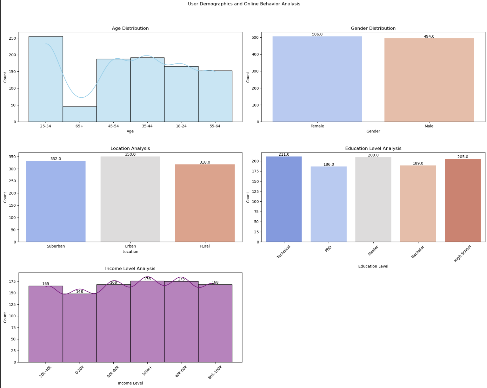

<ul>
    <li><strong>Age:</strong> The user base skews slightly younger, with the largest group falling within the 25-34 age range (255 users). This is followed by the 35-44 (192 users) and 45-54 (188 users) age groups. Teenagers (18-24) and users above 55 are less represented (166 and 153 users respectively).</li>
    <li><strong>Gender:</strong> The gender distribution is relatively balanced, with a slight majority of females (506) compared to males (494).</li>
    <li><strong>Location:</strong> Geographically, the user base seems evenly distributed across urban (350 users), suburban (332 users), and rural (318 users) areas.</li>
    <li><strong>Education Level:</strong> A significant portion of users hold advanced degrees (Master's - 209 users, PhD - 186 users). Technical degrees (211 users) and Bachelor's degrees (189 users) are also well-represented. High school graduates (205 users) form the remaining segment.</li>
    <li><strong>Income Level:</strong> The income distribution suggests a user base with moderate to high purchasing power. The largest group falls within the 40k-60k and 60k-80k income brackets (175 and 168 users respectively). A sizeable portion also earns above 100k annually (176 users). While income levels decrease at the lower and higher ends of the spectrum (20k-40k: 165 users, 0-20k: 148 users), they still hold a presence.</li>
</ul>

<h3><strong>Online Behavior Exploration</strong></h3>

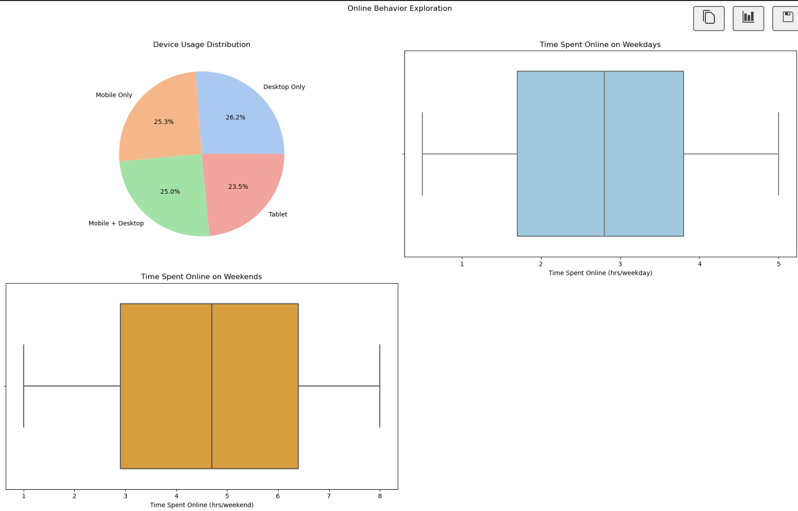

<ul>
    <li><strong>Device Usage Distribution:</strong> The pie chart illustrates the distribution of users across different device categories. It reveals that the user base is fairly evenly split among desktop-only, mobile-only, and a combination of mobile and desktop devices, each representing approximately a quarter of the total users. Tablet usage is slightly less common, with around 23.5% of users accessing the platform through this device.</li>
    <li><strong>Time Spent Online Analysis:</strong> The box plots display the distribution of time spent online by users on both weekdays and weekends. For weekdays, the median time spent online is approximately 2.8 hours, with a relatively narrow interquartile range (IQR) from 1.7 to 3.8 hours. On weekends, users tend to spend more time online, with a median of 4.7 hours and a wider IQR from 2.9 to 6.4 hours. The plots highlight the variability in online behavior between weekdays and weekends, with users generally spending more time online during leisure periods.</li>
</ul>

<h3><strong>User Interaction Analysis</strong></h3>

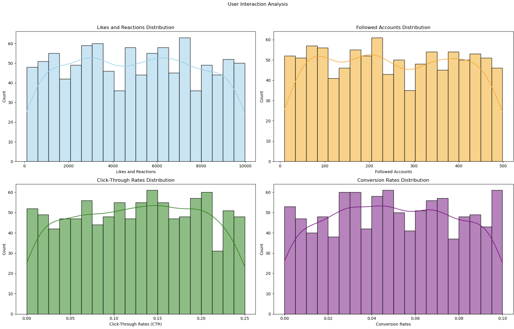

| Metric                 | Mean    | Median | Standard Deviation |
|------------------------|---------|--------|--------------------|
| Likes and Reactions    | 4997.084| 5002.5 | 2838.494           |
| Followed Accounts      | 251.438 | 245.5  | 141.942            |
| Click-Through Rates (CTR) | 0.125   | 0.128  | 0.071              |
| Conversion Rates       | 0.050   | 0.049  | 0.029              |

<ul>
    <li><strong>Likes and Reactions:</strong> The distribution of Likes and Reactions appears to be somewhat right-skewed, with a median of 5002.5 and a mean slightly higher (4997.08). This suggests that a larger portion of users generate a moderate to high number of Likes and Reactions, while there might be a smaller group with exceptionally high engagement. The standard deviation (2838.49) indicates a fair amount of variability in user behavior.</li>
    <li><strong>Followed Accounts:</strong> The distribution of Followed Accounts also seems right-skewed, with a median of 245.5 and a slightly higher mean (251.44). This implies that most users follow a moderate number of accounts, while some follow a significantly higher number. The standard deviation (141.94) reflects some variation in user behavior regarding following accounts.</li>
    <li><strong>Click-Through Rates (CTR):</strong> The Click-Through Rate (CTR) distribution is likely centered around the median (0.128) with a standard deviation (0.0712). This suggests that a majority of users exhibit click-through behavior within a specific range. However, the presence of a tail on either side of the distribution indicates that some users might have very low or very high CTRs.</li>
    <li><strong>Conversion Rates:</strong> Similar to CTR, the Conversion Rate distribution is likely centered around the median (0.049) with a standard deviation (0.0287). This implies that most users fall within a specific conversion rate range. However, as with CTR, there might be users with exceptionally low or high conversion rates.</li>
</ul>

<h3><strong>Text Analysis Exploration</strong></h3>

<strong>Top 15 User Interests</strong>

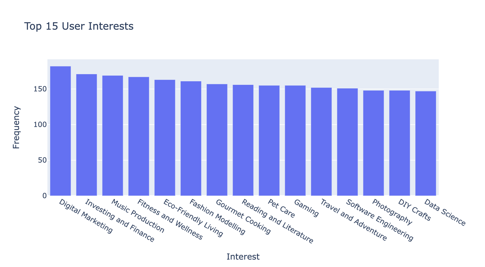

<strong>Top 50 User Interests (Word Cloud)</strong>

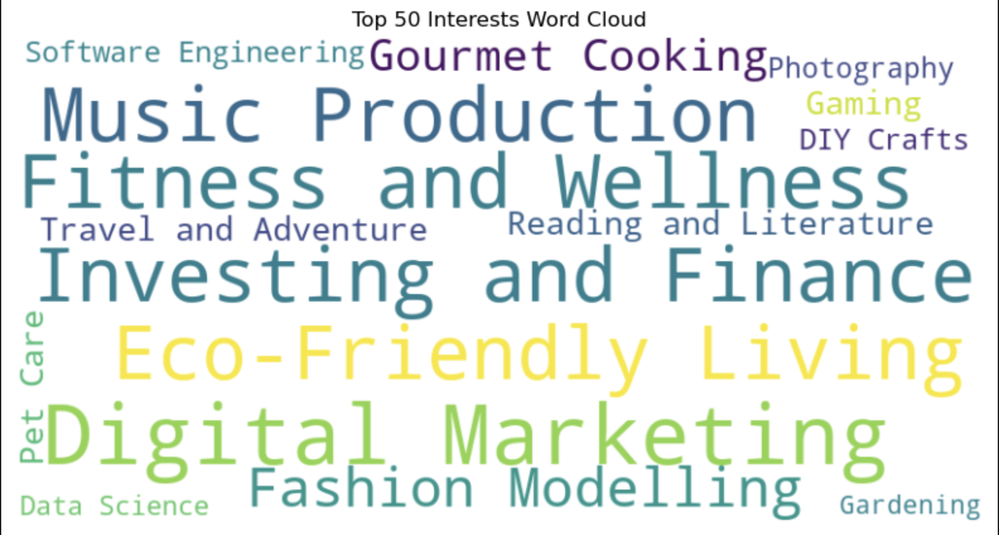

<h2><strong>User Profiling and Segmentation for targeted ad campaigns</strong></h2>

By leveraging the insights gained from user demographics, online behavior, interaction patterns, and potential interests, we can create user profiles and segment our user base into distinct groups. This approach allows for more targeted ad campaigns, ultimately leading to increased user engagement and conversion rates.

<h3><strong>Segmentation Criteria</strong></h3>

User segmentation can be based on various criteria, including:

<ul>
    <li><strong>Demographics:</strong> Age, gender, income level, education level.</li>
    <li><strong>Behavioral:</strong> Time spent online, likes and reactions, click-through rates (CTR), conversion rates.</li>
    <li><strong>Interests:</strong> Analyzing user behavior to identify potential interests and preferences.</li>
</ul>

<h3><strong>Implementing Segmentation</strong></h3>

<ul>
    <li><strong>Clustering Algorithms:</strong> Techniques like K-Means clustering can be used to group users based on similarities in their attributes.
</li>
</ul>

<h3>KMeans Clustering</h3>

The K-Means clustering algorithm successfully segmented the user base into five distinct clusters (0-4). Each cluster exhibits unique characteristics based on the chosen features, including age, gender, income level, online behavior (time spent online, likes, reactions), and engagement metrics. The analysis of these characteristics will help gain valuable insights into the preferences and behaviors of each user segment. These insights will serve as the foundation for developing targeted advertising campaigns tailored to resonate effectively with each segment.

<h3><strong>Identifying the commonalities and differences within each cluster</strong></h3>

To identify the commonalities and differences within each cluster, the mean and mode values of features for each cluster is computed.

| Cluster | Time Spent Online (hrs/weekday) | Time Spent Online (hrs/weekend) | Likes and Reactions | Click-Through Rates (CTR) | Age | Gender | Income Level |
|---------|---------------------------------|----------------------------------|----------------------|---------------------------|-----|--------|--------------|
| 0       | 3.911111                        | 5.212963                         | 2409.620370          | 0.149588                  | 25-34 | Female | 80k-100k     |
| 1       | 1.559394                        | 6.002424                         | 5005.121212          | 0.179836                  | 35-44 | Male   | 80k-100k     |
| 2       | 3.019737                        | 2.584211                         | 6861.587719          | 0.170614                  | 25-34 | Male   | 20k-40k      |
| 3       | 3.080882                        | 5.774510                         | 7457.602941          | 0.067971                  | 25-34 | Female | 100k+        |
| 4       | 1.809626                        | 3.839572                         | 3021.219251          | 0.056594                  | 45-54 | Female | 0-20k        |

<h3><strong>Average behavior and characteristics of users within each cluster</strong></h3>

<ul>
    <li><strong>Cluster 0 - Social Savants:</strong> Users in this cluster, predominantly females aged 25-34 with an income of 80k-100k, spend approximately 3.91 hours on weekdays and 5.21 hours on weekends online. They have moderate levels of likes and reactions and a relatively higher click-through rate (CTR).</li>
    <li><strong>Cluster 1 - Digital Mavericks:</strong> Mostly males aged 35-44 with an income of 80k-100k, users here spend less time on weekdays online but have longer weekend activity. They show higher levels of likes and reactions and a slightly higher CTR.</li>
    <li><strong>Cluster 2 - Zen Navigators:</strong> With a majority of males aged 25-34 and an income of 20k-40k, users in this cluster spend a moderate amount of time online on both weekdays and weekends. They have the highest levels of likes and reactions but a relatively lower CTR.</li>
    <li><strong>Cluster 3 - Exploratory Enthusiasts:</strong> Predominantly females aged 25-34 with a higher income of 100k+, users in this cluster spend a similar amount of time online as Cluster 2 but have higher levels of likes and reactions. However, they have a lower CTR.</li>
    <li><strong>Cluster 4 - Frugal Explorers:</strong> Users here, mostly females aged 45-54 with an income of 0-20k, spend the least amount of time online on both weekdays and weekends. They have lower levels of likes and reactions and the lowest CTR among all clusters.</li>
</ul>

<h3><strong>Reflecting User Segments and Their Distinctive Characteristics via Radar Charts</strong></h3>

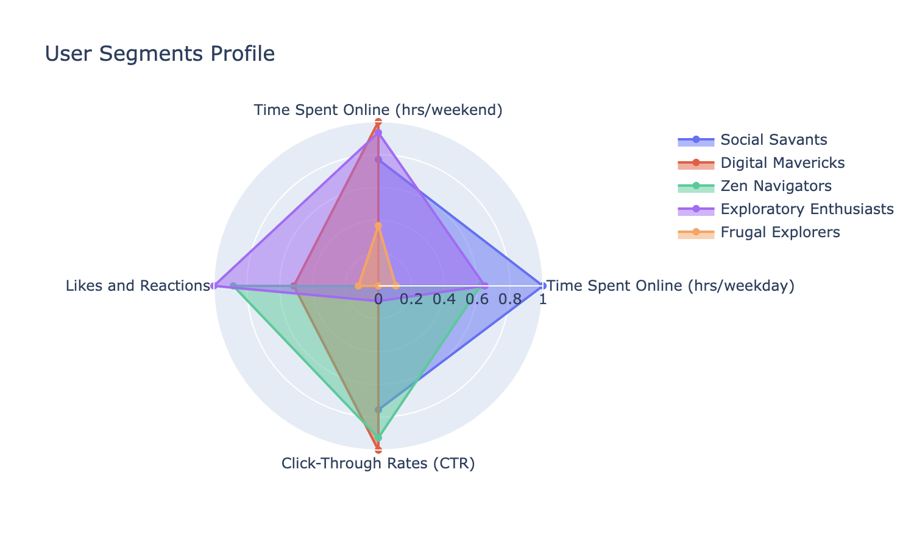

The radar chart provides a comprehensive view of the distinct behavioral patterns exhibited by different user segments. By analyzing key metrics such as time spent online, likes and reactions, and click-through rates across various clusters, marketers gain valuable insights into the preferences and tendencies of each segment. This visualization enables marketers to tailor their advertising campaigns more effectively, aligning content and timing with the unique preferences of each user segment. For instance, campaigns targeting 'Digital Mavericks' may benefit from a data-driven approach, leveraging insights into their high engagement levels and specific interests to optimize ad placement and content. Similarly, understanding the preferences of 'Zen Navigators' can guide marketers in crafting messages that resonate with their preference for quality interactions and meaningful content. By leveraging these insights, marketers can create more targeted and impactful ad campaigns that drive engagement and conversion rates.

<h3><strong>Top Interest Within Clusters</strong></h3>

Based on the frequency counts of interests within each cluster, we can observe distinct patterns that provide valuable insights into the preferences and behaviors of different user segments:

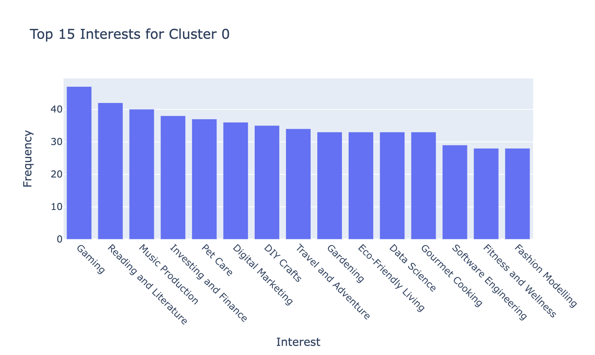

<strong>Cluster 0 (Social Savants):</strong> This cluster shows a strong affinity towards interests such as gaming, reading and literature, music production, and investing and finance. These users are likely to be engaged in a diverse range of activities, including digital marketing, DIY crafts, and pet care, reflecting their varied interests and hobbies.

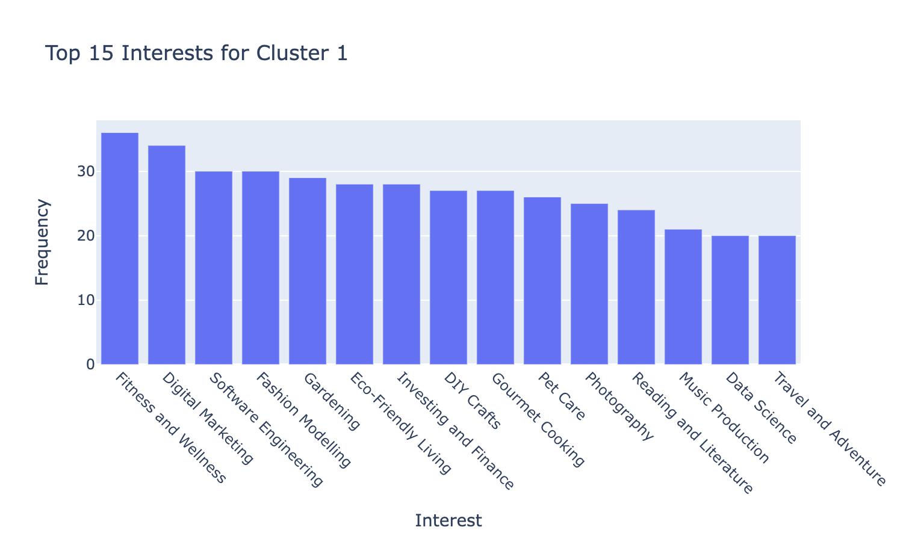

<strong>Cluster 1 (Digital Mavericks):</strong> Users in this cluster exhibit a keen interest in fitness and wellness, digital marketing, software engineering, and fashion modeling. They are likely to be tech-savvy individuals with a focus on personal development and professional growth, as indicated by their interests in gardening, eco-friendly living, and DIY crafts.

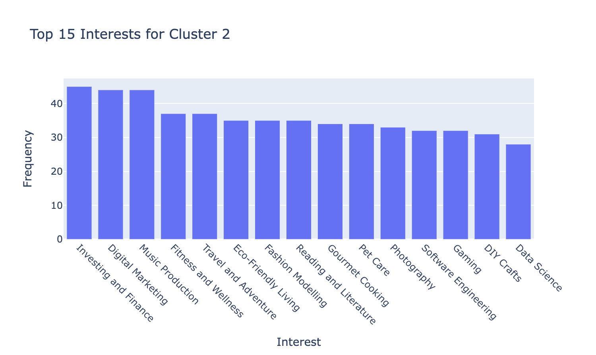

<strong>Cluster 2 (Zen Navigators):</strong> This cluster demonstrates a balanced interest in various domains, including investing and finance, digital marketing, music production, and fitness and wellness. These users are likely to prioritize personal interests such as gourmet cooking, photography, and reading and literature, reflecting a holistic approach to lifestyle and leisure activities.

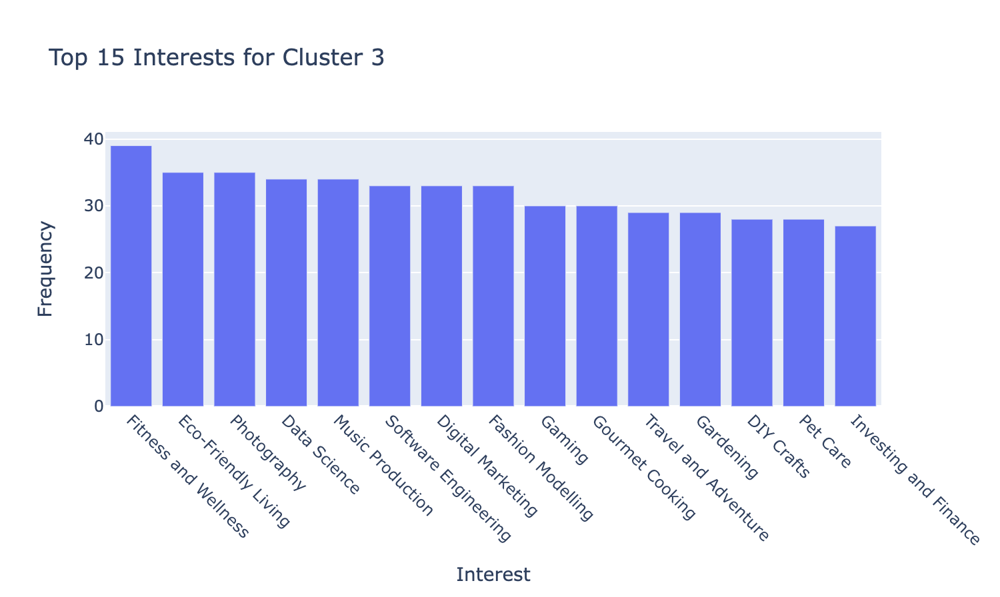

<strong>Cluster 3 (Exploratory Enthusiasts):</strong> Users in this cluster show a strong interest in fitness and wellness, eco-friendly living, photography, and data science. They are likely to be adventurous individuals who enjoy exploring new topics and experiences, as evidenced by their diverse interests in music production, software engineering, and gaming.

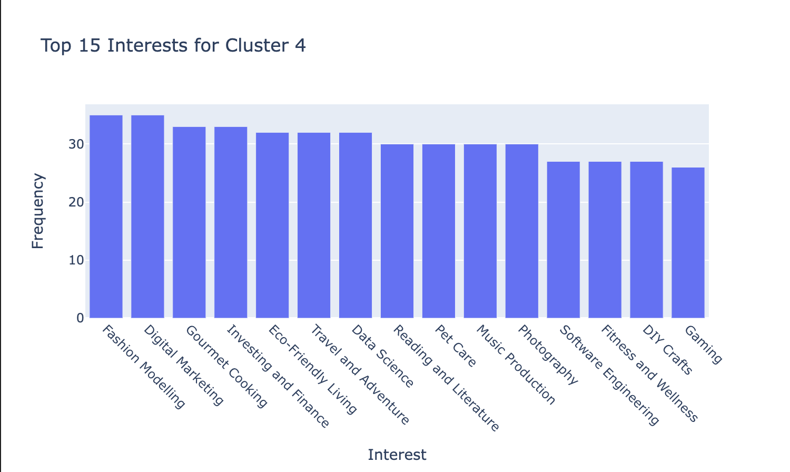

<strong>Cluster 4 (Frugal Explorers):</strong> This cluster exhibits interests in fashion modeling, digital marketing, gourmet cooking, and investing and finance. Users in this segment are likely to be budget-conscious individuals who prioritize value-driven activities and hobbies, as reflected in their interests in eco-friendly living, travel and adventure, and DIY crafts.

<h2><strong>Summary</strong></h2>

This project successfully integrated user profiling, segmentation, and interest analysis to develop targeted advertising campaigns for distinct user segments. Leveraging demographic data, behavioral metrics, and user-generated content, the project gained valuable insights into the preferences and interests of different user groups.

Through user segmentation, five distinct clusters were identified: 'Social Savants', 'Digital Mavericks', 'Zen Navigators', 'Exploratory Enthusiasts', and 'Frugal Explorers', each characterized by unique behavioral patterns and preferences. These insights enabled the creation of tailored advertising strategies that resonate with the diverse needs and preferences of each segment.

The focus on analyzing interests within clusters provided deep insights into user preferences and behaviors. This approach allowed for the development of targeted campaigns that align with the specific interests and behaviors of each user segment.

<h2><strong>Conclusion</strong></h2>

In conclusion, this project underscores the power of combining advanced analytics techniques to drive targeted advertising campaigns. By understanding the nuances of user behavior and preferences, marketers can optimize their advertising efforts, enhance engagement, and drive better business outcomes. This approach not only improves campaign effectiveness but also strengthens customer relationships, ultimately leading to greater success in the competitive digital landscape.
